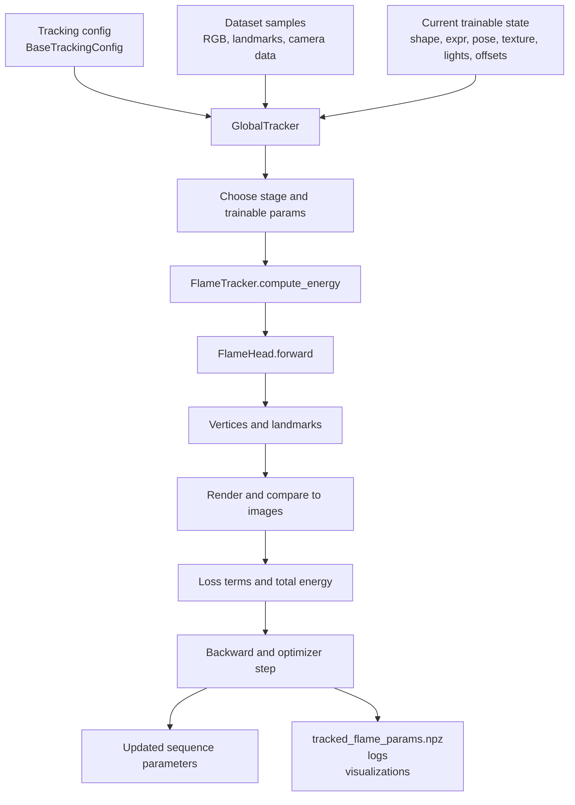

# GlobalTracker, FlameTracker, and FlameHead

## Short version

- `FlameHead` is the differentiable parametric head model. It turns FLAME parameters into vertices and landmarks.
- `FlameTracker` is the reusable optimization core. It wraps `FlameHead` with rendering, losses, regularization, logging, and checkpoint export.
- `GlobalTracker` is the concrete sequence-level trainer and orchestrator. It owns the dataset and trainable tensors, chooses which parameters to optimize at each stage, and runs the end-to-end fitting loop.

A good mental model is:

`GlobalTracker` decides **what to optimize and when**.

`FlameTracker` decides **how to score the current parameters**.

`FlameHead` decides **what 3D head those parameters produce**.

## Start with GlobalTracker

If you want to understand this stack quickly, start with `GlobalTracker`.

`GlobalTracker` is the sequence-level fitting trainer and orchestrator. Its job is to take one video sequence, keep the trainable FLAME-related state for that sequence, run the staged optimization loop, and export the fitted result.

It does not define the FLAME geometry itself, and it does not define a generic reusable neural network to train across many identities. Instead, it optimizes one sequence against a fixed differentiable model and renderer.

### What goes into GlobalTracker

`GlobalTracker` takes three kinds of input.

#### 1. Configuration

From [../vhap/track.py](../vhap/track.py), it is constructed as `GlobalTracker(cfg)`, so the first input is the full tracking config.

That config tells it:

- which dataset to load,
- whether the cameras are calibrated,
- which optimization stages to run,
- which parameters are trainable in each stage,
- the renderer setup,
- learning rates and loss weights,
- output and logging locations.

#### 2. Per-frame data from the dataset

Once initialized, `GlobalTracker` builds the dataset and consumes samples containing things such as:

- RGB images,
- detected 2D landmarks,
- optional alpha maps,
- timestep indices and camera indices,
- camera intrinsics and extrinsics when the sequence is calibrated.

If the sequence is not calibrated, `GlobalTracker` also optimizes focal length and relies on `FlameTracker.fill_cam_params_into_sample()` to synthesize camera parameters for optimization.

#### 3. The current trainable state of the sequence

`GlobalTracker.init_params()` creates and owns the variables that are actually optimized:

- global identity shape,
- per-frame expression,
- per-frame rigid head pose,
- per-frame neck, jaw, and eye pose,
- texture parameters,
- lighting,
- optional static and dynamic geometry offsets,
- focal length for uncalibrated runs.

So a more concrete view is:

input = config + dataset samples + current sequence parameters

### What comes out of GlobalTracker

`GlobalTracker` produces outputs at two levels.

#### 1. Per-iteration outputs

At each optimization step, it produces:

- an energy value for the current batch,
- gradients and updated parameter tensors,
- intermediate geometry and rendering results used for logging.

Those intermediate results are computed through `FlameTracker.compute_energy()` and include vertices, landmarks, albedo, rendered RGB/A, and loss terms.

#### 2. Final sequence outputs

Over the whole run, it writes:

- tracked FLAME parameters as `tracked_flame_params*.npz`,
- scalar logs and media visualizations,
- evaluation outputs in the run directory.

So the practical output is:

output = optimized sequence parameters + exported checkpoint + logs and visualizations

### GlobalTracker input/output illustration

### The simplest way to think about it

`GlobalTracker` is the top-level controller for sequence fitting.

- Input: a sequence plus a config.
- Internal work: repeatedly call the shared loss/rendering logic and update the sequence parameters.
- Output: a fitted FLAME description of that sequence.

## How the stack is used

The entry point in [../vhap/track.py](../vhap/track.py) is intentionally small:

1. Parse `BaseTrackingConfig`.
2. Construct `GlobalTracker(cfg)`.
3. Call `tracker.optimize()`.

From there, the main call chain is:

1. `GlobalTracker.optimize()` picks a stage such as `lmk_init_all` or `rgb_global_tracking`.
2. `GlobalTracker.optimize_iter()` prepares one batch and calls `FlameTracker.compute_energy()`.
3. `FlameTracker.compute_energy()` calls `forward_flame()`.
4. `FlameTracker.forward_flame()` passes the current parameters into `FlameHead.forward()`.
5. `FlameHead.forward()` returns mesh vertices, optional canonical vertices, and landmarks.
6. `FlameTracker` rasterizes and renders the mesh, computes losses, and returns a scalar objective.
7. `GlobalTracker` backpropagates that objective and updates the trainable tensors.

So the data flow is:

images and landmarks -> tracker parameters -> `FlameHead` mesh -> renderer -> losses -> gradient update

## FlameHead

The implementation lives in [../vhap/model/flame.py](../vhap/model/flame.py). This class is the **geometry engine** for the entire tracker.

### What it loads

During initialization, `FlameHead` loads the standard FLAME assets and registers them as buffers:

- `v_template`: neutral template vertices.
- `shapedirs`: identity and expression blend shapes.
- `posedirs`: pose-corrective blend shapes.
- `J_regressor`, `parents`, `lbs_weights`: the ingredients for linear blend skinning.
- landmark embeddings: barycentric data used to recover facial landmarks from the deformed mesh.
- mesh topology and UVs from the template OBJ.
- a Laplacian matrix used later for offset regularization.

In other words, `FlameHead` contains the static model definition of the head.

### VHAP-specific extensions

VHAP does more than load vanilla FLAME. `FlameHead` can also modify the template mesh at construction time:

- `add_teeth()` procedurally adds teeth vertices, faces, UVs, and skinning weights.
- `connect_lip_inside()` closes the inner mouth gap.
- `remove_lip_inside()` removes the inner lip surface.
- `remove_torso()` removes boundary and torso-related faces.
- `disable_deformation_on_torso()` zeros some expression and skinning effects on torso regions.

These options matter because the tracker is not fitting a generic FLAME mesh in isolation. It is fitting a version of FLAME that has been adapted to the rendering and photometric objectives used in VHAP.

### What `forward()` does

`FlameHead.forward()` is the differentiable mesh generator. Given shape, expression, pose, and translation parameters, it performs the standard FLAME pipeline:

$$
v_{shaped} = v_{template} + B_{shape}(\beta) + B_{expr}(\psi) + \delta_{static} + \delta_{dynamic}
$$

$$
v = \mathrm{LBS}(v_{shaped}, \theta) + t
$$

Where:

- $\beta$ is identity shape.
- $\psi$ is expression.
- $\theta$ is the stacked global, neck, jaw, and eye pose.
- $t$ is translation.
- $\delta_{static}$ and $\delta_{dynamic}$ are VHAP's learned geometry offsets.

Concretely, the method:

1. Concatenates shape and expression coefficients into `betas`.
2. Concatenates pose blocks into `full_pose`.
3. Builds a shaped template using blend shapes.
4. Adds optional static and dynamic offsets.
5. Runs linear blend skinning with the FLAME kinematic tree.
6. Applies global translation.
7. Computes landmarks by barycentric interpolation on the deformed mesh.

It can return:

- final vertices,
- canonical vertices before articulation, and
- landmarks.

That canonical output is important because the tracker uses it to regularize learned offsets.

### What FlameHead is not responsible for

`FlameHead` does not know about images, losses, datasets, optimizers, or training stages. It is a differentiable head model, not a tracker by itself.

## FlameTracker

The implementation lives in [../vhap/model/tracker.py](../vhap/model/tracker.py). This class is the shared optimization core that sits directly on top of `FlameHead`.

### Why it exists

`FlameTracker` factors out everything that is common to tracking regardless of the dataset loop:

- instantiate geometry and texture models,
- instantiate the renderer,
- turn parameter tensors into meshes and images,
- compute losses,
- compute regularizers,
- log and export results.

It is not fully standalone. It expects a subclass to provide things such as:

- `self.shape`, `self.expr`, `self.rotation`, `self.translation`, and the other trainable tensors,
- `self.dataset`, `self.n_timesteps`, and `self.image_size`,
- whether the setup is calibrated.

So `FlameTracker` behaves like a reusable base class with almost all of the math and only part of the application setup.

### What it builds in `__init__`

The constructor creates:

- one `FlameHead`,
- either a painted texture module or PCA texture module,
- one UV mask helper,
- one differentiable renderer.

That means `FlameTracker` owns the model components that are shared across all frames.

### Core responsibilities

#### 1. Parameter-to-mesh evaluation

`forward_flame()` is the bridge between tracker state and geometry. It reads the current trainable tensors for a list of timesteps and passes them to `FlameHead.forward()`. It also expands the current albedo texture so rendering can happen in the same batch.

This is the point where tracker state becomes actual 3D head geometry.

#### 2. Camera completion for uncalibrated data

`fill_cam_params_into_sample()` fills intrinsics and extrinsics into each sample when the dataset does not provide calibrated cameras. In that case, the tracker optimizes focal length and uses a fixed default rigid transform.

#### 3. Rendering

`rasterize_flame()`, `render_rgba()`, and `render_normal()` convert the FLAME mesh into image-space quantities. They use the active renderer backend and the texture and lighting state owned by the tracker.

#### 4. Energy terms

`FlameTracker` defines the objective that optimization minimizes:

$$
E = w_{lmk} E_{lmk} + w_{photo} E_{photo} + E_{reg}
$$

The exact active terms depend on the stage.

- `compute_lmk_energy()` compares predicted FLAME landmarks to detected 2D landmarks.
- `compute_photometric_energy()` renders RGBA output and compares the rendered head to the target image.
- `compute_regularization_energy()` adds priors and smoothness terms for shape, expression, joints, lighting, texture, and offsets.

The regularization block is substantial. It includes:

- pose smoothness over time,
- joint priors and temporal smoothness,
- expression and shape penalties,
- texture penalties,
- lighting penalties,
- static and dynamic offset penalties, including Laplacian and temporal terms.

This is the real reason `FlameTracker` exists: it defines how VHAP turns a head model into an optimization problem.

#### 5. Stage-aware objective assembly

`compute_energy()` is the top-level scoring function for one batch. It:

1. runs `forward_flame()`,
2. adds landmark loss if enabled,
3. adds photometric loss for photometric stages and evaluation,
4. adds regularization for training stages,
5. sums everything into `E_total`.

That method is the main boundary between the optimization loop and the model internals.

#### 6. Optimizer configuration and export

`configure_optimizer()` assigns different learning rates to groups such as translation, expression, camera, lights, and offsets.

`save_result()` exports the tracked state to an `.npz` file containing pose, expression, shape, texture, lighting, offsets, timestep ids, and image size. This is the tracker handoff artifact for downstream processing.

### What FlameTracker does not decide

`FlameTracker` does not decide:

- which dataset to use,
- when landmarks should be detected,
- how many frames exist,
- which stages run in what order,
- which parameters are trainable in a given stage.

Those decisions are made by `GlobalTracker` and the config objects.

## GlobalTracker Details

`GlobalTracker` is the concrete subclass that turns `FlameTracker` into an end-to-end sequence fitting trainer.

If you think in trainer terms, that is basically correct. The nuance is that it is not training a reusable network from scratch. It is optimizing one sequence's latent state, appearance, pose, lighting, and optional offsets against a fixed differentiable FLAME model and renderer.

### What it adds in `__init__`

`GlobalTracker.__init__()` does the application setup that the base class intentionally omits:

- records whether the data is calibrated,
- ensures 2D landmarks exist on disk through `detect_landmarks()`,
- creates the output folder, TensorBoard writer, and logger,
- instantiates the dataset,
- records `image_size` and `n_timesteps`,
- initializes all trainable tensors through `init_params()`,
- optionally loads a previous `.npz` checkpoint.

This is where the trainer becomes tied to an actual dataset sequence.

### Trainable state owned by GlobalTracker

`init_params()` creates the parameter tensors optimized over the sequence:

- identity shape,
- per-frame expression,
- per-frame rigid pose: translation and rotation,
- per-frame neck, jaw, and eye pose,
- texture parameters,
- spherical-harmonic lighting when enabled,
- optional static and dynamic geometry offsets,
- focal length for uncalibrated runs.

All of these tensors are plain PyTorch tensors with `requires_grad=True`. `GlobalTracker` owns them; `FlameTracker` consumes them.

### Why the class is called GlobalTracker

The name is slightly broader than just the final global optimization stage. The class handles the full sequence pipeline, including both local and global fitting:

1. initialize the first frame,
2. track sequentially over time,
3. refine all frames jointly.

### Stage scheduling

The stage definitions come from [../vhap/config/base.py](../vhap/config/base.py). `GlobalTracker.optimize()` follows a two-phase schedule.

#### First phase: initialization and sequential tracking

For the first frame, it runs rigid and full landmark initialization. If photometric fitting is enabled, it then initializes texture, all non-offset parameters, and optional static offsets.

After that, each frame is optimized sequentially with either:

- `rgb_sequential_tracking`, or
- `lmk_sequential_tracking`.

After solving the current frame or timestep block, `initialize_next_timestep()` copies the last solved per-frame state into the next contiguous timestep block as a warm start. That makes the next optimization much easier.

#### Second phase: global refinement

Once the entire sequence has a reasonable solution, `GlobalTracker` switches to shuffled batches over the full dataset and runs either:

- `rgb_global_tracking`, or
- `lmk_global_tracking`.

This stage jointly refines shared and per-frame parameters across the whole sequence.

### Stage-specific trainable parameters

`get_train_parameters()` reads the current stage configuration and exposes only the relevant tensors to the optimizer. This is how VHAP cleanly separates, for example:

- rigid initialization,
- expression and joint tracking,
- texture fitting,
- offset fitting,
- full global refinement.

So the stage config controls the optimization policy, while `FlameTracker` still defines the actual objective.

### One iteration of optimization

`optimize_iter()` is the concrete training step:

1. clear renderer caches,
2. fill camera parameters if needed,
3. compute the energy through `FlameTracker.compute_energy()`,
4. run `backward()`,
5. call `optimizer.step()`,
6. log scalars and media periodically.

That is the point where the three classes meet in one loop:

- `GlobalTracker` owns the loop,
- `FlameTracker` builds the loss,
- `FlameHead` generates the geometry.

## Relationship summary

If you want the shortest correct description of the architecture, it is this:

- `FlameHead` is the differentiable FLAME-based head generator.
- `FlameTracker` is the rendering-and-loss wrapper around that generator.
- `GlobalTracker` is the sequence-level trainer/orchestrator that feeds data and parameters through the wrapper.

Or, phrased as questions:

- `FlameHead`: what mesh and landmarks do these parameters imply?
- `FlameTracker`: how well does that mesh explain the current image and landmarks?
- `GlobalTracker`: how should those parameters be updated across the whole sequence?

## Source pointers

- [../vhap/track.py](../vhap/track.py)
- [../vhap/model/tracker.py](../vhap/model/tracker.py)
- [../vhap/model/flame.py](../vhap/model/flame.py)
- [../vhap/config/base.py](../vhap/config/base.py)
- [flame_head.md](flame_head.md)